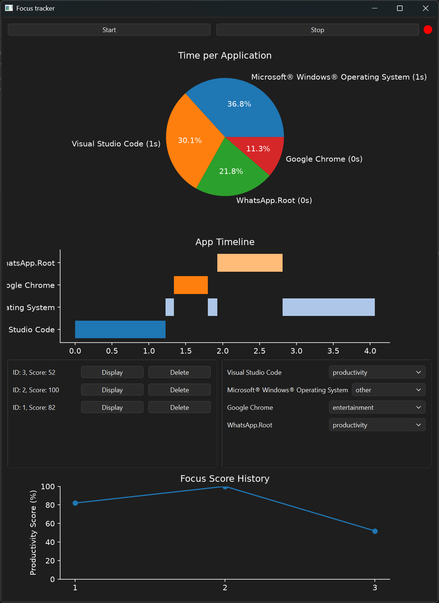

# Focus Tracker

I wanted to know where my afternoons were actually going, so I built this. It runs quietly in the background on Windows, logs which app is in focus, and shows you where your time went once you stop tracking.

## What it does

- Tracks foreground app switches automatically (no manual logging) using a Windows event hook
- Lets you tag each app as productivity / entertainment / other
- Saves each tracking session as a report with a productivity score
- Shows a pie chart of time per app, a timeline of switches, and a line chart of your score over past sessions

## Screenshot



## Running it

```bash
pip install PyQt6 matplotlib pywin32 psutil
python main.py
```

Click **Start** to begin tracking, **Stop** to end the session and save it as a report. This is a Windows only application as it relies on the Win32 foreground-window API.

## Stack

Python, PyQt6, matplotlib, SQLite, pywin32
